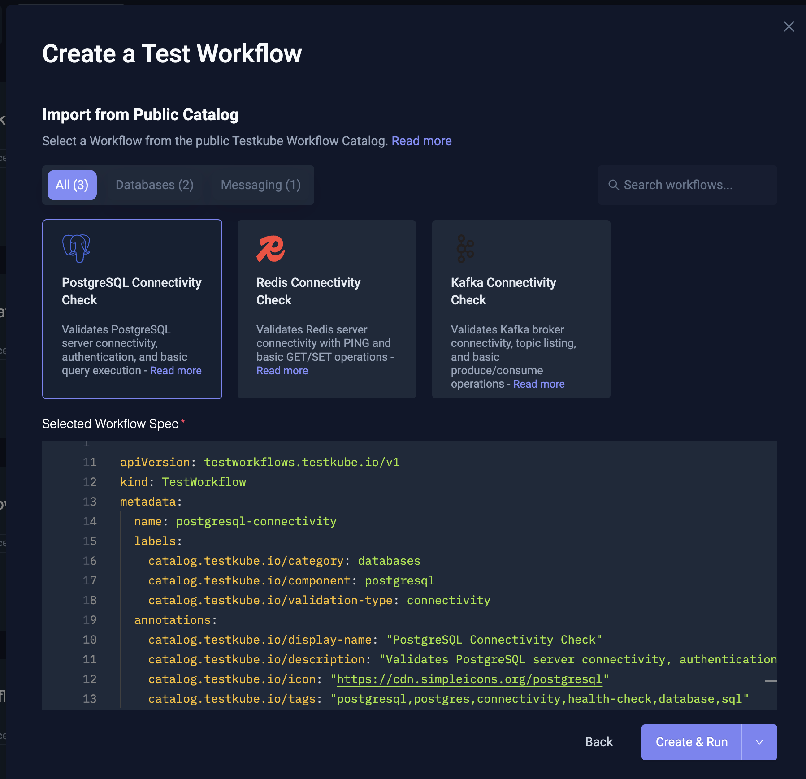

# Testkube Infrastructure Validation Marketplace

A community-driven collection of reusable [Testkube](https://testkube.io) TestWorkflows for validating infrastructure components in Kubernetes environments.

## Overview

This repository contains pre-built TestWorkflows that validate the configuration and health of common infrastructure components like databases, message brokers, caching systems, and more. Read More about TestWorkflows [in the documentation](https://docs.testkube.io/articles/test-workflows).

**Key Features:**
- 🔌 **Plug-and-play** - Configure and run in minutes
- 🔒 **Security-first** - All images vetted and digest-pinned
- 🏷️ **Well-categorized** - Easy to browse and discover
- 🤝 **Community-driven** - Open for contributions

## Repository Structure

```
workflows/
├── databases/          # PostgreSQL, MySQL, MongoDB, Redis
├── messaging/          # Kafka, RabbitMQ, NATS
├── caching/            # Redis, Memcached
├── storage/            # MinIO, Elasticsearch
├── networking/         # Ingress controllers, Service mesh
├── observability/      # Prometheus, Grafana, Jaeger
└── security/           # Vault, cert-manager
└── kubernetes/         # GPUs, Namespaces, Pod-Health, etc
└── other/              # Anything that doesn't fit these categories

```

## Quick Start

### 1. Browse Available TestWorkflows

You can browse the marketplace from the Testkube Dashboard, the CLI, or directly in this GitHub
repository — see the full guide in the [Testkube docs](https://docs.testkube.io/articles/examples/marketplace).

**From the CLI** (works with both OSS and Pro/Cloud installs):

```bash
# List every workflow
testkube marketplace list

# Filter by category or component
testkube marketplace list --category databases
testkube marketplace list --component redis

# Inspect a workflow's parameters and metadata
testkube marketplace get redis-connectivity
```

**From the Dashboard:** the [Testkube Dashboard](https://docs.testkube.io/articles/testkube-dashboard-explore)
provides a wizard for browsing this repository when creating new TestWorkflows:



**From this repo:** explore the `workflows/` directory to find validation TestWorkflows for your
infrastructure components.

### 2. Deploy a TestWorkflow

The fastest way is to install directly from the marketplace, applying any parameter overrides up front:

```bash
# Install with the workflow's defaults
testkube marketplace install redis-connectivity

# Override one or more parameters; values are written into spec.config.<key>.default
testkube marketplace install redis-connectivity \
  --set host=my-redis.default.svc.cluster.local \
  --set port=6379

# Validate without creating, or upsert an existing workflow
testkube marketplace install redis-connectivity --dry-run
testkube marketplace install redis-connectivity --update
```

You can also apply a workflow directly from its raw GitHub URL without cloning the repo:

```bash
testkube create testworkflow --url \
  https://raw.githubusercontent.com/kubeshop/testkube-marketplace/main/workflows/databases/redis/redis-connectivity.yaml
```

Or, if you prefer working from a local checkout:

```bash
# Apply directly to your Testkube instance
kubectl apply -f workflows/databases/redis/redis-connectivity.yaml

# Or use the Testkube CLI
testkube create testworkflow -f workflows/databases/redis/redis-connectivity.yaml
```

### 3. Run the TestWorkflow

```bash
# Run with the defaults (or whatever values were applied via marketplace install --set)
testkube run testworkflow redis-connectivity

# Or override parameters per-run with --config
testkube run testworkflow redis-connectivity \
  --config host=my-redis.default.svc.cluster.local \
  --config port=6379
```

> Tip: `testkube marketplace install --set key=value` rewrites the workflow's `spec.config.<key>.default`
> values, so subsequent `testkube run` calls do not need to repeat `--config` overrides.

## TestWorkflow Metadata

All TestWorkflows in this repository include standardized metadata for easy discovery:

### Labels (for filtering)

| Label | Purpose | Values |
|-------|---------|--------|
| `marketplace.testkube.io/category` | Infrastructure type | `databases`, `messaging`, `caching`, `storage`, `networking`, `observability`, `security`, `other` |
| `marketplace.testkube.io/component` | Specific component | `redis`, `postgresql`, `kafka`, etc. |
| `marketplace.testkube.io/validation-type` | What's being validated | `connectivity`, `health`, `performance`, `security` |

### Annotations (for display)

| Annotation | Purpose |
|------------|---------|
| `marketplace.testkube.io/display-name` | Human-readable name |
| `marketplace.testkube.io/description` | What the workflow validates |
| `marketplace.testkube.io/icon` | Icon identifier for UIs |
| `marketplace.testkube.io/tags` | Search keywords |

## Security

All workflows in this repository follow strict security guidelines:

- ✅ **Approved registries only** - Images from vetted sources
- ✅ **Digest pinning** - Immutable image references
- ✅ **Automated validation** - CI checks on every PR

See [CONTRIBUTING.md](CONTRIBUTING.md) for details.

## Contributing

We welcome contributions! Please read our [Contributing Guidelines](CONTRIBUTING.md) before submitting a PR.

## License

This project is licensed under the Apache License 2.0 - see the [LICENSE](LICENSE) file for details.
